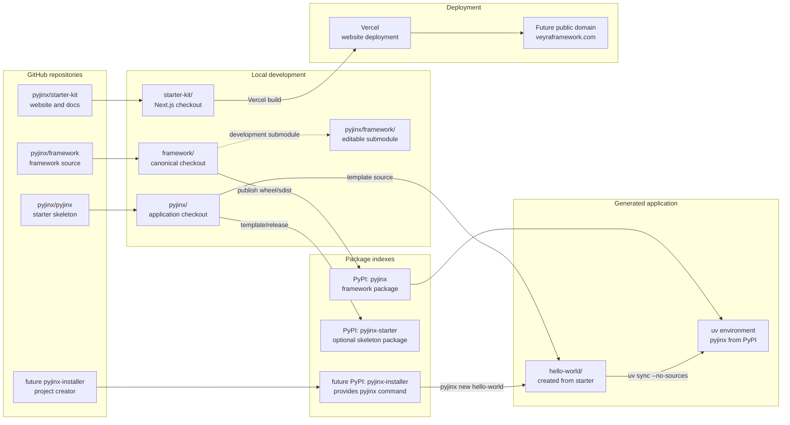
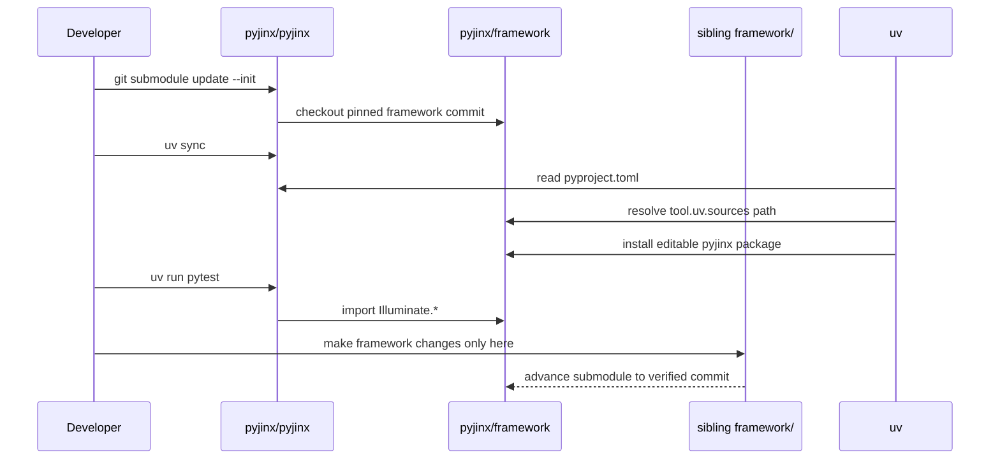
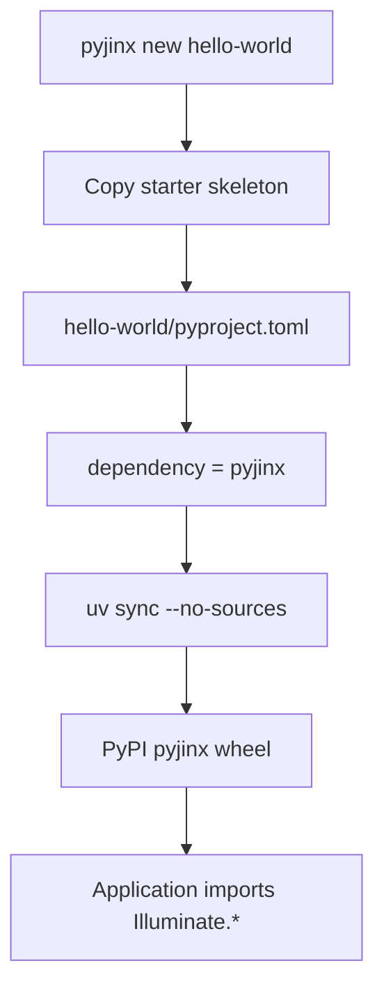

# PyJinx / Veyra Repository Architecture

This document separates repository identity, package identity, import identity,
CLI identity, and deployment identity. They are related, but they are not the
same thing.

## Current workspace layout

```text
~/WorkSpace/Code/pyjinx/
├── framework/                 # canonical framework repository
│   ├── Illuminate/             # top-level Python import namespace
│   ├── pyproject.toml          # PyPI distribution: pyjinx
│   └── docs/
├── pyjinx/                    # application skeleton repository
│   ├── framework/              # development-only git submodule checkout
│   ├── app/, bootstrap/, ...   # Laravel-style application skeleton
│   ├── pyproject.toml          # distribution: pyjinx-starter
│   └── uv.lock
└── starter-kit/                # website repository
    ├── app/                    # Next.js marketing/docs routes
    ├── content/docs/           # Markdown/MDX narrative docs
    └── openapi/                # OpenAPI source artifacts
```

`pyjinx/framework` inside the application repository is a development checkout
of the canonical sibling `framework` repository. It is not a second framework
implementation and is not copied into generated production projects.

## End-to-end architecture



## Identity map

| Layer | Current temporary identity | Future Veyra identity | Purpose |
|---|---|---|---|
| Framework repository | `pyjinx/framework` | `veyra/framework` | Framework source and history |
| Framework PyPI distribution | `pyjinx` | `veyra` | Installable framework package |
| Framework Python imports | `Illuminate.*` | Migration decision required | Laravel-compatible import namespace |
| Skeleton repository | `pyjinx/pyjinx` | `veyra/starter` | Laravel-style project template |
| Skeleton distribution | `pyjinx-starter` | `veyra-starter` | Optional template package |
| Installer distribution | `pyjinx-installer` (future) | `veyra-installer` | Global project creator |
| Installer command | `pyjinx new hello-world` | `veyra new hello-world` | Creates a new project |
| Project-local framework CLI | `loom serve`, `loom migrate`, `loom test` | Same `loom` command | Artisan-equivalent app command tool |
| Website repository | `pyjinx/starter-kit` | `veyra/starter-kit` | Marketing site and docs |
| Temporary website URL | Vercel `starter-kit` aliases | Veyra public domain | Public website and docs |

A distribution name is not an import name. Installing `pyjinx` must continue to
provide imports such as:

```python
from Illuminate.Database.QueryBuilder import QueryBuilder
```

The future installer distribution must not also be named `pyjinx`, because the
framework package already owns that PyPI name. Its distribution is
`pyjinx-installer`, while its executable is `pyjinx`.

## Development dependency flow



## Generated project dependency flow

Generated applications must not contain the development submodule:



Development uses the local path source:

```bash
uv sync
```

Production-like dependency resolution ignores local sources:

```bash
uv sync --no-sources
```

## Website and API documentation flow

```mermaid
flowchart LR
    PY[Python framework/API contract] --> SPEC[OpenAPI JSON/YAML]
    SPEC --> DOCS[Fumadocs OpenAPI]
    MDX[Handwritten MDX] --> FUMADOCS[Fumadocs MDX]
    FUMADOCS --> NEXT[Next.js App Router]
    DOCS --> NEXT
    NEXT --> VERCEL[Vercel]
    VERCEL --> ROOT[/]
    VERCEL --> DOCROUTE[/docs]
    VERCEL --> APIROUTE[/docs/api]
```

The website repository is independent from the Python repositories. Its
narrative docs are Markdown/MDX; API pages are generated from OpenAPI artifacts
and must not duplicate the Python endpoint contract by hand.

## External mapping summary

| Local/repository artifact | External target | Current status |
|---|---|---|
| `framework/` | `github.com/pyjinx/framework` | Framework source repository |
| `pyjinx/` | `github.com/pyjinx/pyjinx` | Starter skeleton repository |
| `starter-kit/` | `github.com/pyjinx/starter-kit` | Website MVP repository |
| Framework wheel | `pypi.org/project/pyjinx` | Package identity; publish/release lifecycle remains separate |
| Starter wheel/template | `pypi.org/project/pyjinx-starter` | Optional template distribution |
| Website deployment | Vercel `starter-kit` project | Production deployment is ready; access protection may require Vercel configuration |
| Future public site | `veyraframework.com` | Planned after naming migration and release audit |

## Rules

1. Edit framework source only in `framework/`.
2. Keep `pyjinx/framework` as a pinned development submodule checkout.
3. Generated applications depend on the published framework package, not the
   submodule.
4. Keep `Illuminate.*` imports until the dedicated Veyra migration approves a
   namespace transition.
5. Keep handwritten docs separate from generated OpenAPI pages.
6. Do not publish the temporary Veyra/PyJinx repositories publicly until the
   naming and release audit is complete.
